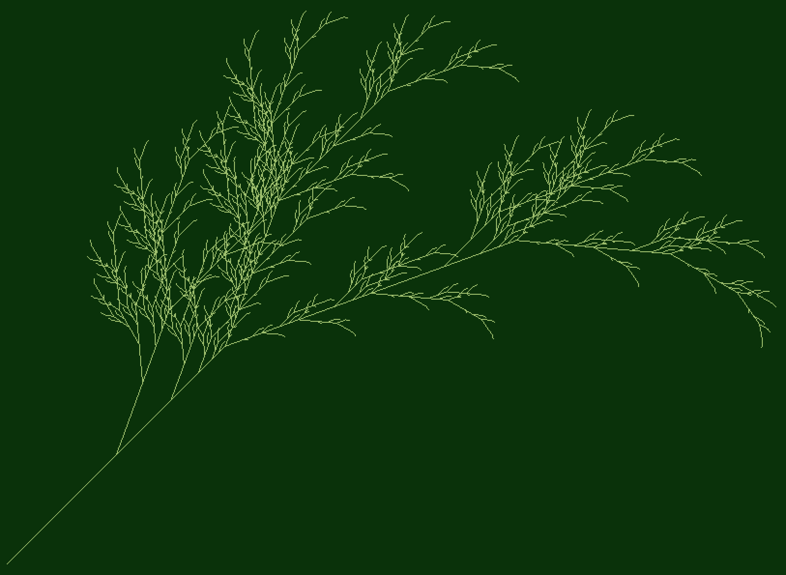
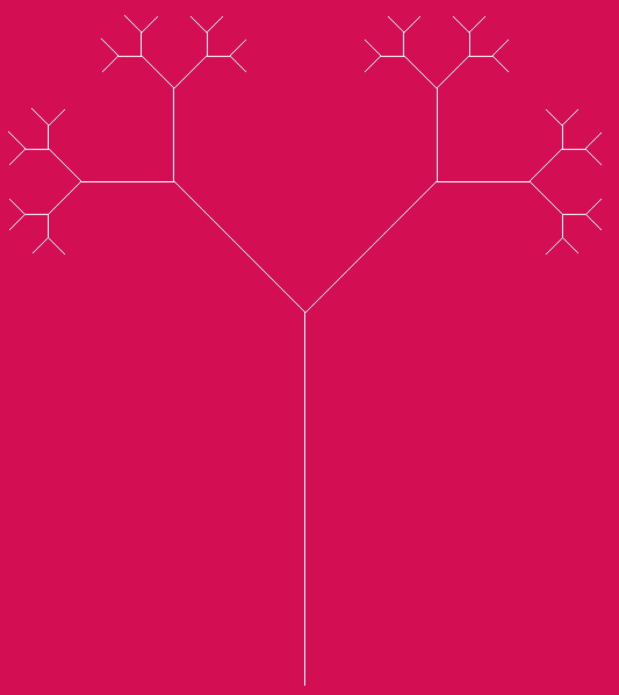

# L-Systems and Haskell

Aim of this project is to experiment with [L-System](https://en.wikipedia.org/wiki/L-system)s in Haskell.

It leverages on [gloss](https://hackage.haskell.org/package/gloss) library.


## Pre requirements
### Stack

It can be downloaded from [Stack](https://docs.haskellstack.org/en/stable/README/)  official site

## Build
```bash
stack setup
stack build
stack exec -- haskellsys
```

## Output drawings
**FractalTree.hs**



**PythagorasTree.hs**


